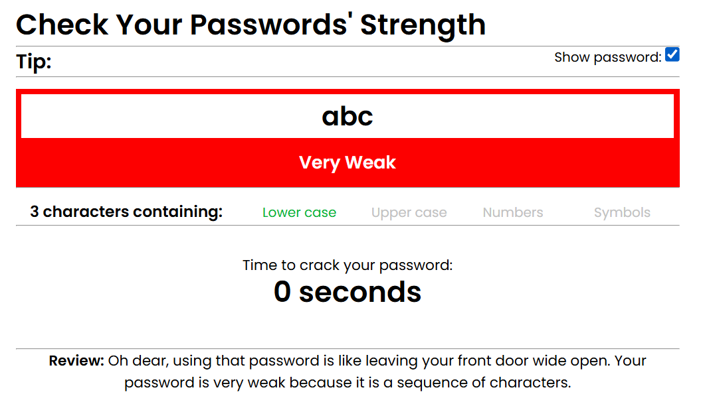
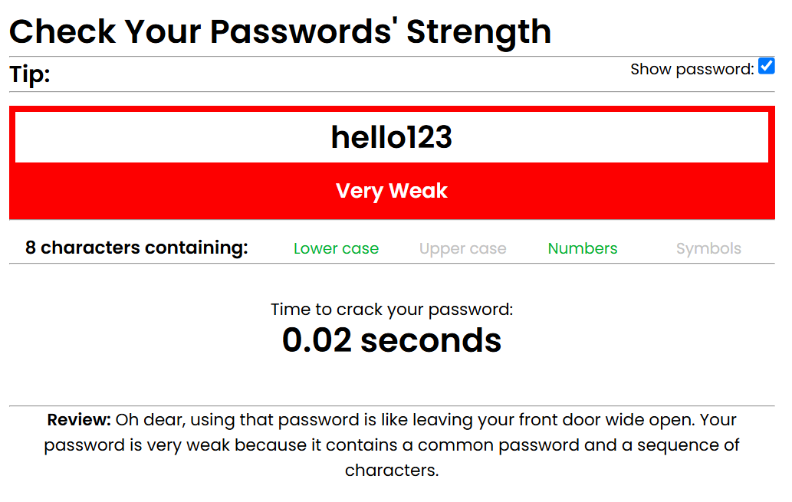
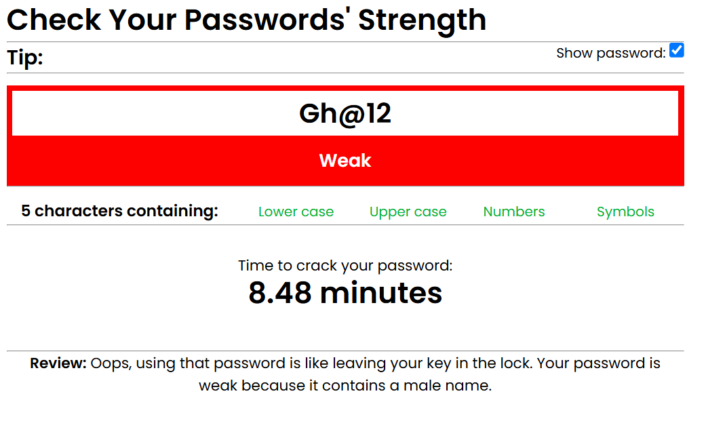
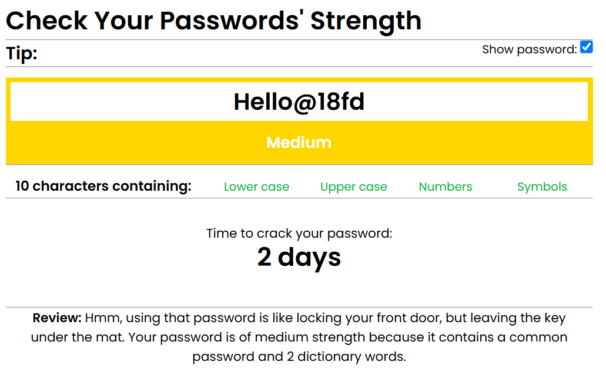
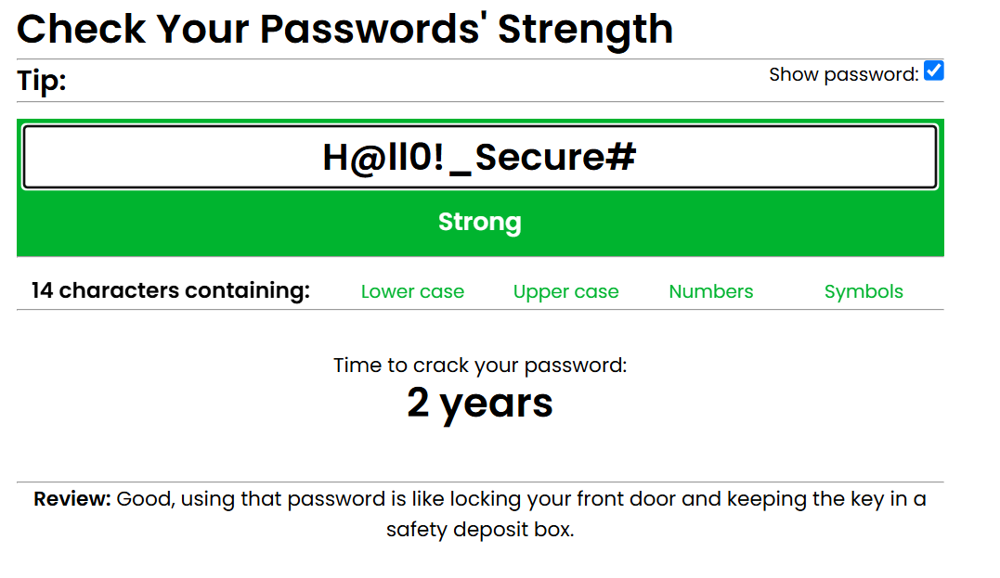
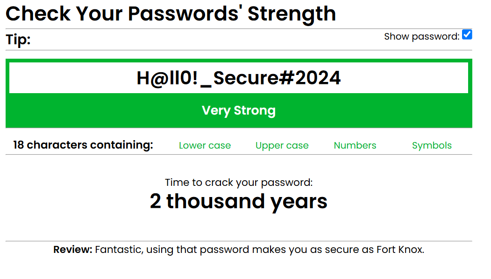

# 🔐 Password Strengthometer

A lightweight and intuitive tool to visualize the strength of a password based on complexity rules. The Password Strengthometer categorizes passwords into six levels: **Very Weak**, **Weak**, **Medium**, and **Strong**, providing visual feedback for better password practices.

## 🚀 Live Demo

Try it out here:  
👉 [Check Password Strength](https://ghanshamsoomarani.github.io/password_strengtho_meter.github.io/checkpass.html)

## 📸 Screenshots

Below are visual examples of how different passwords are evaluated by the strengthometer:

### 🔴 Very Weak Password (e.g., `123`, `hello123`)
  

### 🟠 Weak Password (e.g., `Gh@12`)

### 🟡 Medium Password (e.g., `Hello@18fd`)

### 🟢 Strong Password (e.g., `H@ll0!_Secure#`)

### 🟢 Very Strong Password (e.g., `H@ll0!_Secure#2024`)

> All strength levels are determined based on length, inclusion of lowercase, uppercase, numbers, special characters, male and female names and dictionary words .

## 🛠️ Features

- Real-time password strength feedback
- Customizable strength logic
- Review about your password
- Do not save your data

## 📂 Project Structure

