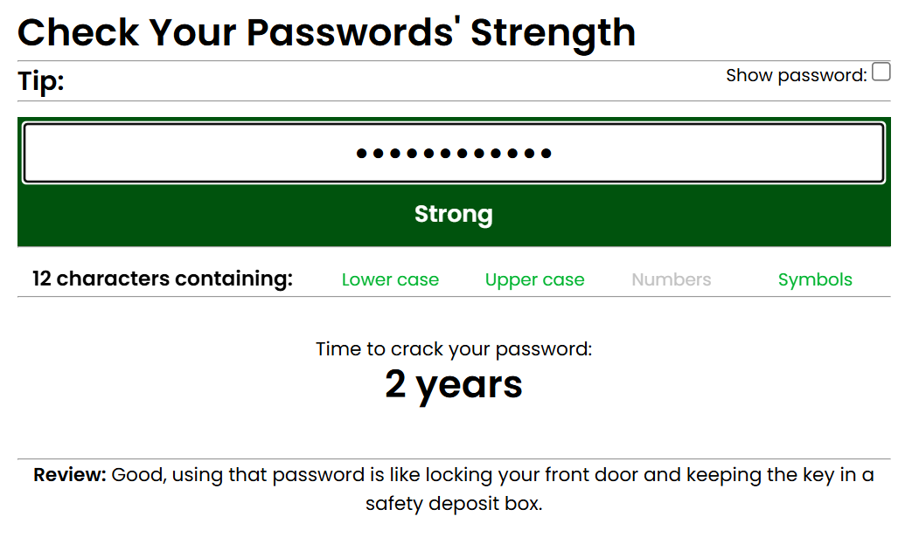
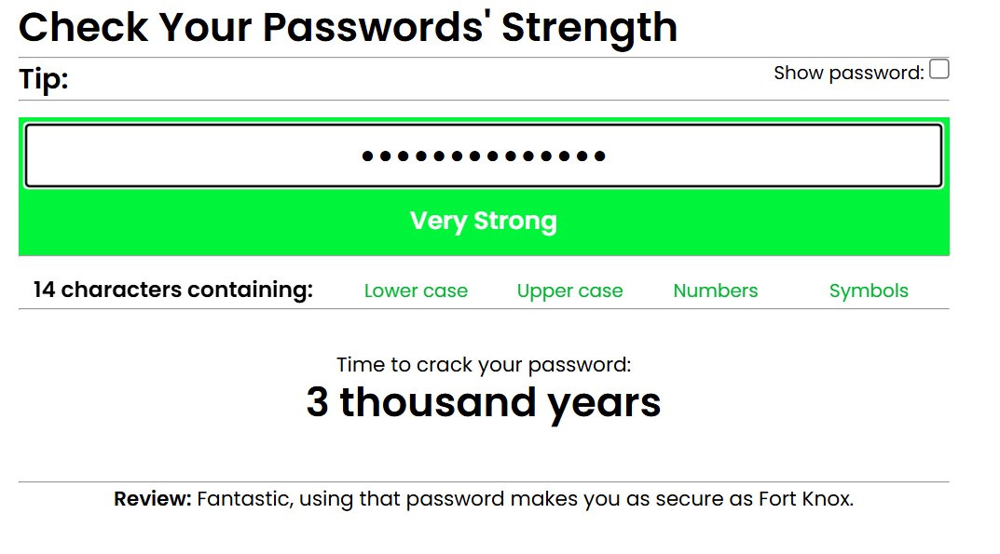

# 🔐 Password Strength-o-Meter

A simple, interactive web tool that visually indicates the strength of your password in real time. It helps users create more secure passwords by evaluating their strength using custom logic and provides color-coded feedback (Very Weak to Very Strong).
## 🚀 Live Demo

Try it out here:  
👉 [Check Password Strength](https://ghanshamsoomarani.github.io/password_strengtho_meter.github.io/checkpass.html)

## 📸 Screenshots

Below are visual examples of how different passwords are evaluated by the strengthometer:

### 🔴 Very Weak Password (e.g., `123`, `hello123`)
  

### 🟠 Weak Password (e.g., `Gh@12`)

### 🟡 Medium Password (e.g., `Hello@18fd`)

### 🟢 Strong Password (e.g., `H@ll0!_Secure#`)

### 🟢 Very Strong Password (e.g., `H@ll0!_Secure#2024`)

> All strength levels are determined based on length, inclusion of lowercase, uppercase, numbers, special characters, male and female names and dictionary words .

## 🛠️ Features

- ✅ Real-time password strength feedback

- ✅ Five levels of strength analysis

- ✅ Color-coded visual indicators (🔴 🟠 🟡 🟢)

- ✅ Lightweight and fast — no backend required

- ✅ Privacy-focused — no password data is saved

- ✅ Detects dictionary words and names

